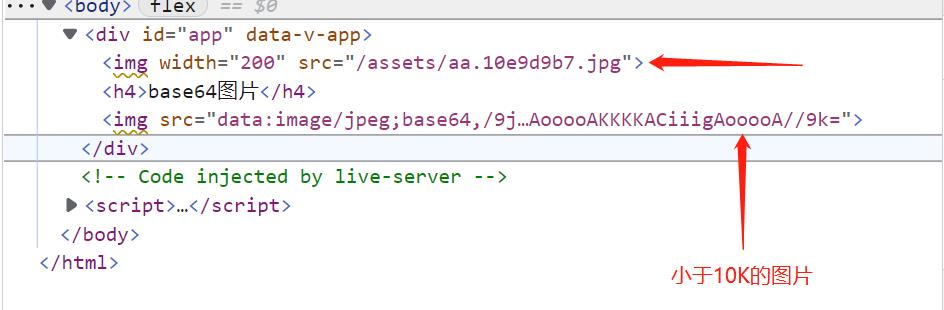

# Vite

## 开始

+ `Vite`官网地址  [点击此处访问](https://cn.vitejs.dev/)
+ 使用 `npm` 安装 `vite`
  ```shell
    npm create vite@latest
  ```
+ 创建项目
  ```shell
    npm create vite@latest 项目名 --template 模板名
  ```

## 配置

创建好的 `vite` 项目下，会在 <span class="font-blue">项目根目录下</span> 存在 `vite.config.js` 文件。

## 静态资源处理

<span class="font-blue">静态资源</span> 在前端项目中是不可或缺的，比如 `图片`、 `字体`、 `音视频` 等。

### 资源引入为URL

引入文件代码如下: 
```vue
  <script setup>
    import img from './assets/aa.jpg';
  </script>

  <template>
    
  </template>
```

### 使用路径别名来修改路径地址

上述的代码如果存在嵌套目录过深的问题，可以考虑修改 `vite.config.js` 添加路径别名来优化，配置如下：
```javascript
export default defineConfig({
  plugins: [vue()],
  resolve: {
    alias: {
      '@': '/src'
    }
  }
})
```
修改后上面引入文件可以修改为：
```vue
<script setup>
  import img from '@/assets/aa.jpg';
</script>

<template>
  
</template>
```

### 资源内联限制

小于此阈值的导入或引用资源将内联为 base64 编码，以避免额外的 http 请求。设置为 0 可以完全禁用此项。
```javascript
export default defineConfig({
  plugins: [vue()],
  build: {
    // 10KB以内会被转换为base64
    assetsInlineLimit: 10 * 1024
  }
})
```
;


